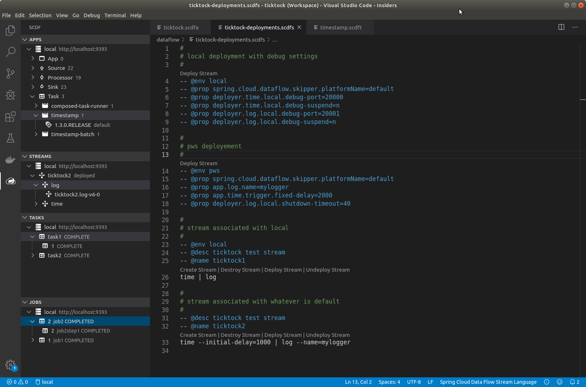

ifdef::env-github[]
:tip-caption: :bulb:
:note-caption: :information_source:
:important-caption: :heavy_exclamation_mark:
:caution-caption: :fire:
:warning-caption: :warning:
endif::[]
:toc:
:toc-placement!:

= Spring Cloud Data Flow VSCode Extension Documentation

toc::[]

ifdef::env-github[]
link:extension-basics.adoc[]

link:registering-environment.adoc[]

link:manage-applications.adoc[]

link:manage-streams.adoc[]

link:manage-tasks.adoc[]

link:manage-jobs.adoc[]

link:install-extension.adoc[]
endif::[]

_Spring Cloud Data Flow VSCode Extension_ main focus is to ease managing _SCDF_
environments from a developer perspective and to provide easier way to debug

_streams_ and _tasks_ at a runtime environments.

ifdef::env-github[]
[NOTE]
====
As we're still in an initial development stage, this extension is not
yet available from a VSCode marketplace. See link:install-extension.adoc[]
more about how to install this extension.
====
endif::[]

ifndef::env-github[]
[NOTE]
====
As we're still in an initial development stage, this extension is not
yet available from a VSCode marketplace. See <<vscode-install-extension>>
more about how to install this extension.
====
endif::[]

ifndef::env-github[]
include::extension-basics.adoc[]

include::registering-environment.adoc[]

include::manage-applications.adoc[]

include::manage-streams.adoc[]

include::manage-tasks.adoc[]

include::manage-jobs.adoc[]

include::install-extension.adoc[]
endif::[]
