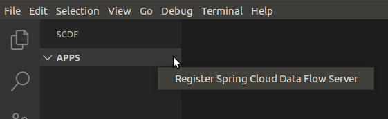
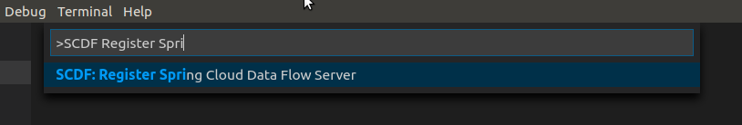
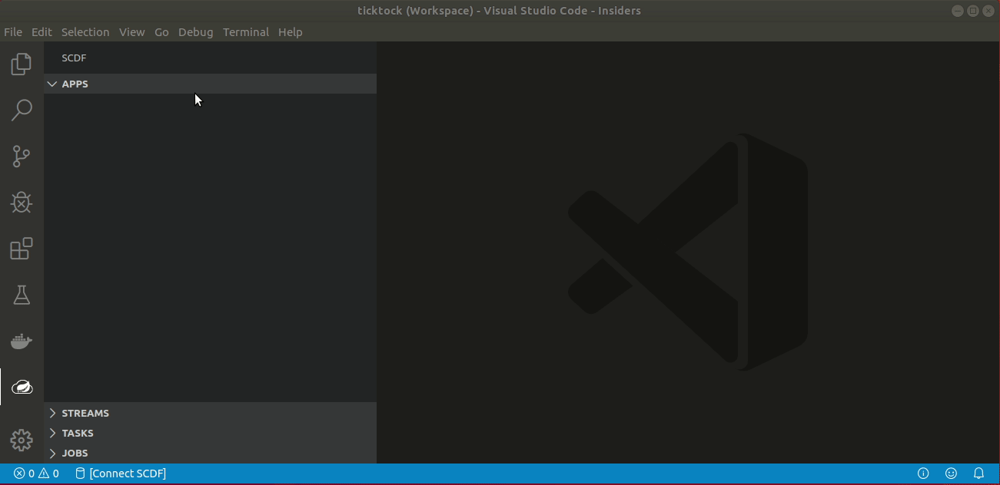

ifdef::env-github[]
:tip-caption: :bulb:
:note-caption: :information_source:
:important-caption: :heavy_exclamation_mark:
:caution-caption: :fire:
:warning-caption: :warning:
endif::[]
:toc:
:toc-placement!:
= Spring Cloud Data Flow VSCode Extension Documentation

toc::[]

_Spring Cloud Data Flow VSCode Extension_ main focus is to ease managing _SCDF_
environments from a developer perspective and to provide easier way to debug
_streams_ and _tasks_ at a runtime environments.

[NOTE]
====
As we're still in an initial development stage, this extension is not
yet available from a VSCode marketplace. See <<vscode-install-extension>>
more about how to install this extension.
====

== Extension Basics

After extension is activated there is a new view on a activation bar with a _SCDF logo_
which gives a view into your configured _SCDF_ environments. In this view we're basically
following what's available in _SCDF UI_ giving separate sections for *apps*, *streams*,
*tasks* and *jobs*.

image::images/vscode-docs-generic-1.png[]

== Registering Environment

Extension support managing multiple _SCDF_ environments. _Register Spring Cloud Data Flow Server_
can be either launched from _Apps_ context menu:

Or from a global command palette:

You need to give a server address, environment name and optional credentials if
environment is secured.

[IMPORTANT]
====
Credentials are stored in an OS keyring meaning you don't see those leaking
into VSCode's configuration files.
====

[[vscode-manage-applications]]
== Manage Applications

_Apps_ section has a navigator which allows you to browse registered apps, sources, processors,
sinks and tasks. Navigator also shows application versions and allows you to _unregister_ or set
_default version_ directly from a tree.

image::images/vscode-docs-apps-explorer-1.png[]

=== Application Language

_SCDF Application Language_ is a *scdfa* format for importing applications into a system.
Every individual application is identified which can be _registered_ or _unregistered_
directly from an editor. It's also possible to import all apps available from a file.

image::images/vscode-docs-apps-language-1.gif[]

[[vscode-manage-streams]]
== Manage Streams

_Streams_ section has a navigator which allows you to browse existing streams.

image::images/vscode-docs-streams-explorer-1.png[]

=== Stream Language

_SCDF Stream Language_ is a *scdfs* format for defining stream definitions and their
launch configurations.

image::images/vscode-docs-streams-language-1.gif[]

[[vscode-manage-tasks]]
== Manage Tasks

_Tasks_ section has a navigator which allows you to browse existing tasks.

image::images/vscode-docs-tasks-explorer-1.png[]

=== Task Language

_SCDF Task Language_ is a *scdfs* format

image::images/vscode-docs-tasks-language-1.gif[]

[[vscode-manage-jobs]]
== Manage Jobs

_Jobs_ section has a navigator which allows you to browse existing jobs.

image::images/vscode-docs-jobs-explorer-1.png[]

[[vscode-debug-support]]
== Debug Support

We're still trying to figure out what is a best approach for this extension
to support debugging streams and tasks in a running SCDF environment. Essentially
this boils down to be able to connect you debugger into a running stream or
task application.

We currently have a support for this to work on a limited capability when
working with a local environment.

[[vscode-debug-support-streams]]
=== Debugging Streams

Generic stream debug workflow is shown below:

image::images/vscode-docs-debug-streams-1.gif[]

What happened in this debug session:

- Simple _ticktock_ stream is created.
- We have a sources for _log sink_ in a workspace.
- Extension is able to detect running debug settings from a stream app instance.
- Debug session is launched.
- We go to source where actual log entry happens and put a breakpoint there.
- Session is halted.

[[vscode-debug-support-tasks]]
=== Debugging Tasks

Generic task debug workflow is shown below:

image::images/vscode-docs-debug-tasks-1.gif[]

What happened in this debug session:

- Simple _timestamp_ task is created.
- We have a sources for _timestgamp task_ in a workspace.
- We go to source where actual log entry happens and put a breakpoint there.
- Task is launced with instruction to suspend a session.
- Extension is able to detect running debug settings from a task app instance.
- Debug session is launched.
- Session is halted.

[[vscode-install-extension]]
== Installing Extension

Extension can be installed using a latest _vsix_ file available from a
https://repo.spring.io/libs-snapshot-local/org/springframework/cloud/dataflow/vscode-spring-cloud-dataflow/[SCDF VSCode Extension Snapshot Repo].
These files has a format _vscode-spring-cloud-dataflow-<version>-next.<date>.<time>.<gitref>.vsix_
where latest build is at a bottom of a page.

While it's easy to install _vsix_ within a *VSCode* itself, for those wanting to
handle new install and updated install from a command line, generic flow is like:

[source, bash]
----
$ code --uninstall-extension vscode-spring-cloud-dataflow-0.0.1-next.20191102.163127.8ba2b02.vsix
$ code
$ code --install-extension vscode-spring-cloud-dataflow-0.0.1-next.20191102.163127.8ba2b02.vsix
----

[TIP]
====
It's a little unknown annoyance in VSCode that when updating your extension
from a command line like this, after you've done the _uninstall-extension_
you need to once start VSCode for uninstallation to actually happen, then
you just do _install-extension_ and you're ready to go.
====
