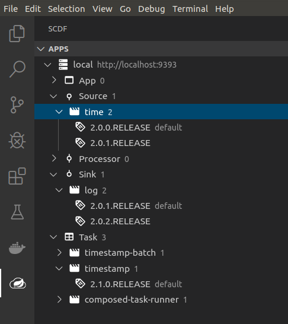
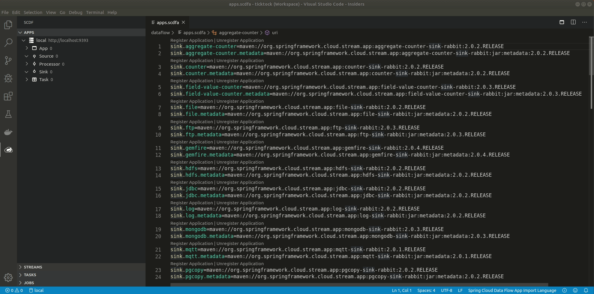

ifdef::env-github[]
:tip-caption: :bulb:
:note-caption: :information_source:
:important-caption: :heavy_exclamation_mark:
:caution-caption: :fire:
:warning-caption: :warning:
endif::[]

[[vscode-manage-applications]]
== Manage Applications

_Apps_ section has a navigator which allows you to browse registered apps, sources, processors,
sinks and tasks. Navigator also shows application versions and allows you to _unregister_ or set
_default version_ directly from a tree.

=== Application Language

_SCDF Application Language_ is a *scdfa* format for importing applications into a system.
Every individual application is identified which can be _registered_ or _unregistered_
directly from an editor. It's also possible to import all apps available from a file.

