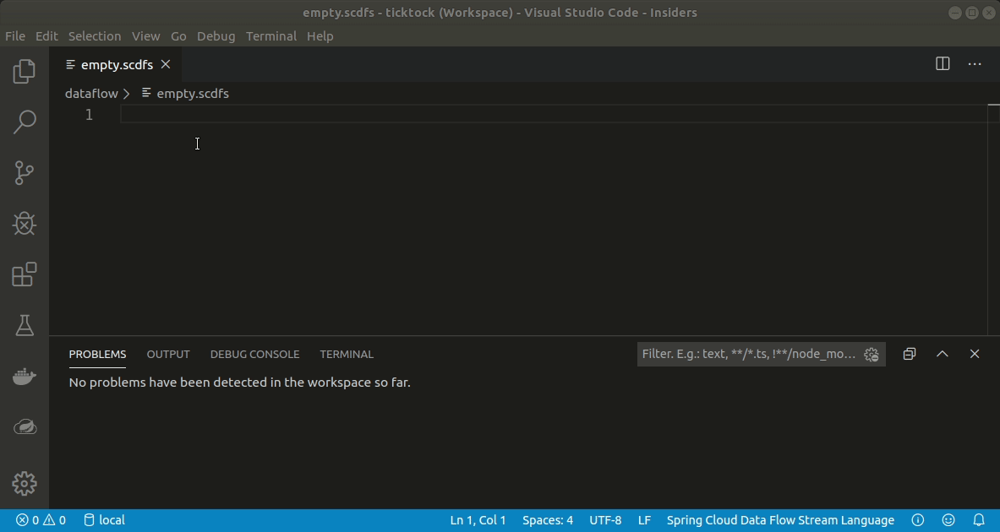
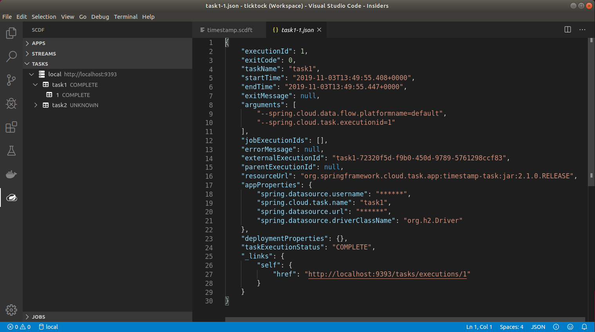
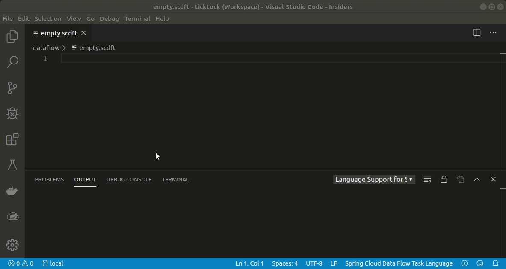
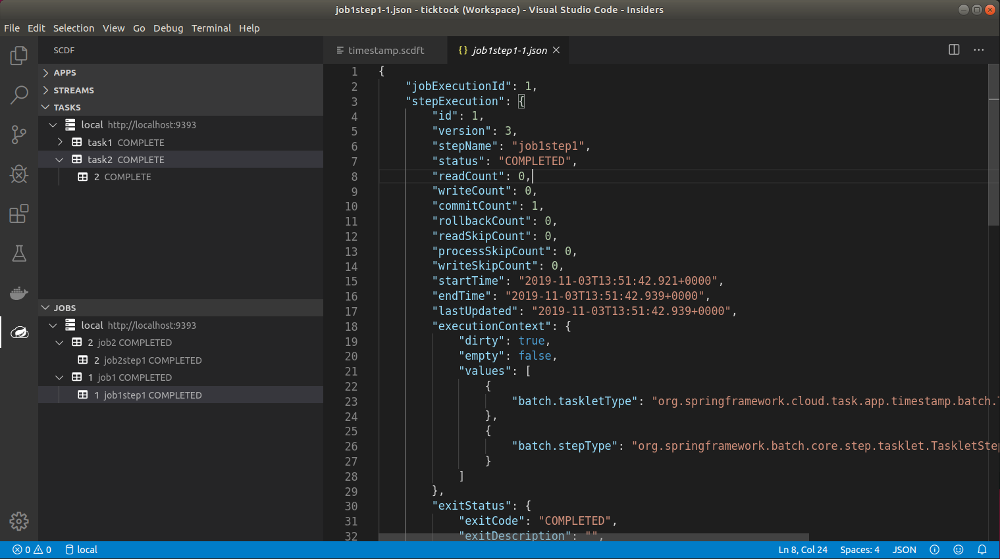
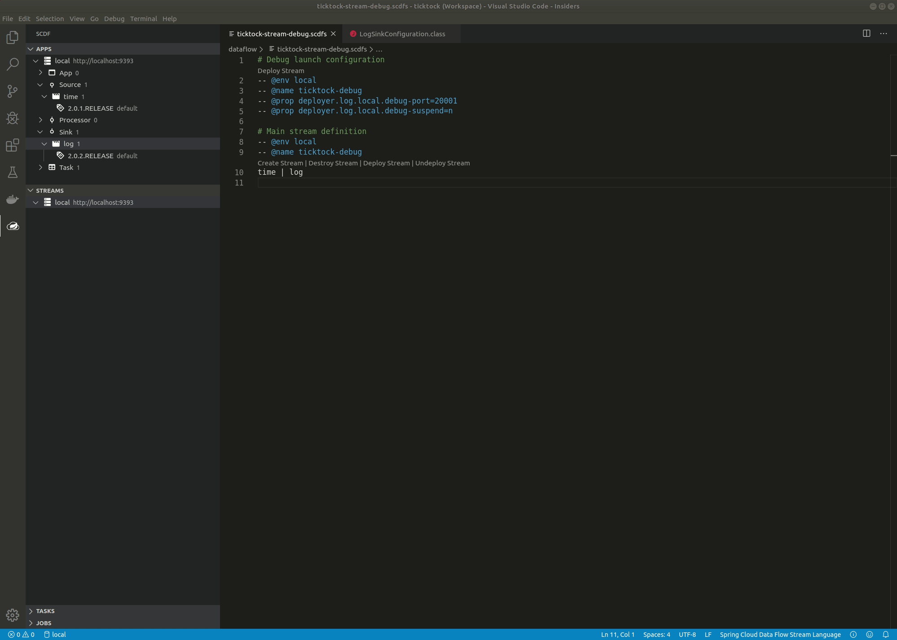
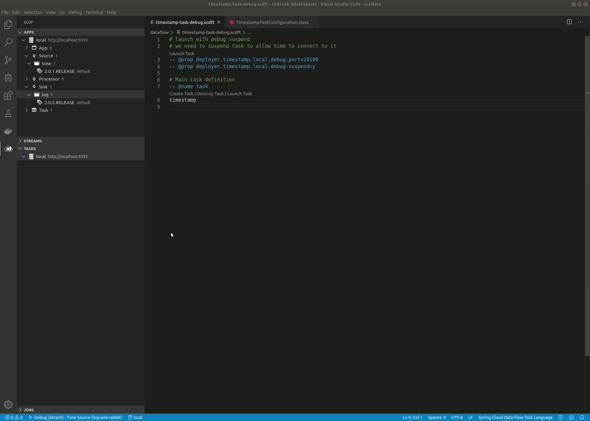

ifdef::env-github[]
:tip-caption: :bulb:
:note-caption: :information_source:
:important-caption: :heavy_exclamation_mark:
:caution-caption: :fire:
:warning-caption: :warning:
endif::[]

[[vscode-manage-streams]]
== Manage Streams

_Streams_ section has a navigator which allows you to browse existing streams.

=== Stream Language

_SCDF Stream Language_ is a *scdfs* format for defining stream definitions and their
deploy configurations.

_Stream Definition_ can have associated metadata sections which either adds instructions
to main definition or its deployer configuration. For example it's possible to define
_@env_ to associate it to particular environment, _@name_ to define a stream name,
_@desc_ to define a stream description.

For deploy sections it's also possible to define generic deployment properties using
_@prop_ tag.

[source]
----
# Debug launch configuration
-- @env local
-- @name ticktock-debug
-- @prop deployer.log.local.debug-port=20001
-- @prop deployer.log.local.debug-suspend=n

# Main stream definition
-- @env local
-- @desc my stream description
-- @name ticktock-debug
time | log
----

[[vscode-manage-tasks]]
== Manage Tasks

_Tasks_ section has a navigator which allows you to browse existing tasks.

=== Task Language

_SCDF Task Language_ is a *scdfs* format for defining task definition and their
launch configurations.

_Task Definition_ can have associated metadata sections which either adds instructions
to main definition or its launch configuration. For example it's possible to define
_@name_ to define a stream name or _@desc_ to define a stream description.

For deploy sections it's also possible to define generic deployment properties using
_@prop_ tag and a _@arg_ tag to define tasks command line arguments.

[source]
----
# launch with a command line arg
-- @arg --timestamp.format=yyyy

# launch with debug suspend
# we need to suspend task to allow time to connect to it
-- @prop deployer.timestamp.local.debug-port=20100
-- @prop deployer.timestamp.local.debug-suspend=y

# Main task definition
-- @name task
timestamp
----

[[vscode-manage-jobs]]
== Manage Jobs

_Jobs_ section has a navigator which allows you to browse existing jobs.

[[vscode-debug-support]]
== Debug Support

We're still trying to figure out what is a best approach for this extension
to support debugging streams and tasks in a running SCDF environment. Essentially
this boils down to be able to connect you debugger into a running stream or
task application.

We currently have a support for this to work on a limited capability when
working with a local environment.

[[vscode-debug-support-streams]]
=== Debugging Streams

Generic stream debug workflow is shown below:

What happened in this debug session:

- Simple _ticktock_ stream is created.
- We have a sources for _log sink_ in a workspace.
- Extension is able to detect running debug settings from a stream app instance.
- Debug session is launched.
- We go to source where actual log entry happens and put a breakpoint there.
- Session is halted.

[[vscode-debug-support-tasks]]
=== Debugging Tasks

Generic task debug workflow is shown below:

What happened in this debug session:

- Simple _timestamp_ task is created.
- We have a sources for _timestamp task_ in a workspace.
- We go to source where actual log entry happens and put a breakpoint there.
- Task is launced with instruction to suspend a session.
- Extension is able to detect running debug settings from a task app instance.
- Debug session is launched.
- Session is halted.
